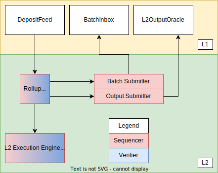
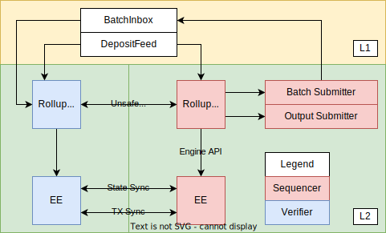

# Optimism Overview

<!-- START doctoc generated TOC please keep comment here to allow auto update -->
<!-- DON'T EDIT THIS SECTION, INSTEAD RE-RUN doctoc TO UPDATE -->
**Table of Contents**

- [Components](#components)
  - [L1 Components](#l1-components)
  - [L2 Components](#l2-components)
  - [Types of Rollup Nodes](#types-of-rollup-nodes)
  - [Transaction/Block Propagation](#transactionblock-propagation)
- [Protocol Operation](#protocol-operation)
  - [Deposits](#deposits)
  - [L2 Chain Derivation](#l2-chain-derivation)

<!-- END doctoc generated TOC please keep comment here to allow auto update -->

This document is a high-level technical overview of the Optimism protocol. It aims to explain how the protocol works in an informal manner, and direct readers to other parts of the specification so that they may learn more. A basic understanding of how optimistic rollups work is a prerequisite to reading this document.

## Components

### L1 Components

**DepositFeed**

- A smart contract that processes deposits from L1 to L2.
- Though the name `DepositFeed` implies depositing tokens, in reality any valid Ethereum transaction can be deposited into the `DepositFeed`.

**BatchInbox**

- An address that the Batch Submitter uses to submit transaction batches.
- Counter-intuitively, this address does not contain a smart contract since we can instead send calldata directly to an EOA.

**L2OutputOracle**

- A smart contract that stores L2 output roots.

### L2 Components

**Rollup Node**

- A standalone binary that sits between the execution engine and L1.
- Derives data from L1, and handles L1 reorgs.
- Validates incoming block data.
- Prepares execution payloads as per the [Engine API](https://hackmd.io/@n0ble/consensus_api_design_space).
- Distributes unsubmitted blocks to other rollup nodes.

**Execution Engine (EE)**

- A vanilla Geth node with minor modifications to support Optimism.
- Syncs state to other nodes on the Optimism network via a P2P network.
- Maintains L2 state.
- Serves the Engine API to the Rollup Node.

**Batch Submitter**

- A background process that submits transaction batches to the `BatchInbox` address.

**Output Submitter**

- A background process that submits L2 state roots to the `L2OutputOracle`.

### Types of Rollup Nodes

There are two types of nodes on Optimism: sequencers, and verifiers.

- **Sequencers** are responsible for accepting user-sent and deposit transactions, ordering them into L2 blocks, and submitting batch/output roots to L1.
- **Verifiers** reconstruct the L2 chain from data on l1.

Both node types run the EE and Rollup Node to maintain their view of the rollup state.

Sequencers, however, also perform block production and batch/output submission. There is currently only one sequencer. We may support distributed sequencing in the future.

### Transaction/Block Propagation

Since the EE uses Geth under the hood, Optimism uses Geth's built-in peer-to-peer network and transaction pool to propagate transactions. The same network can also be used to propagate submitted blocks and support snap-sync. 

Unsubmitted blocks, however, are propagated using a separate peer-to-peer network of Rollup Nodes. This is optional, however, and is provided as a convnience to lower latency for users.

The below diagram illustrates how the sequencer and verifiers fit together:

**Spec links:**

- [Execution Engine](specs/exec-engine.md)

## Protocol Operation

### Deposits

Optimism supports two types of deposits: user deposits, and L1 attributes deposits. To perform a user deposit, users call the `depositTransaction` method on the `DepositFeed` contract. This in turn emits `TransactionDeposited` events, which the rollup node reads during block derivation.

L1 attributes deposits are used to register L1 block attributes (number, timestamp, etc.) on L2 via a call to the L1 Attributes Predeploy. They cannot be initiated by users, and are instead added to L2 blocks automatically by the rollup node.

Both deposit types are represented by a custom EIP-2718 transaction type on L2.

**Spec links:**

- [Deposits](./deposits.md)

### L2 Chain Derivation

Like all rollups, the L2 chain can be derived from L1 state alone. Understanding how L2 is derived from L1 is key to understanding other aspects of the protocol, so it will be explained first.

**Spec links:**

- [Rollup Node](./rollup-node.md)
- [Execution Engine](./exec-engine.md)

**Step 1: Calculate The Sequencing Window**

The L2 chain is synthesized from a series of _sequencing windows_. A sequencing window is a fixed number of consecutive L1 blocks that each derivation step uses as input. The block number of the first block in a window is called its `epoch`. Here it is explained visually, using a 4 block sequencing window:

The rollup node increments the epoch on every iteration of the derivation loop. This creates an overlapping effect like the one illustrated in the diagram above.

**Step 2: Download Data**

The rollup node downloads the following data for each sequencing window:

- Block data for all blocks in the window.
- Transaction batches for all blocks in the window.
- `TransactionDeposited` logs for the first block in the window.

Note that L1 blocks within the sequencing window may contain multiple batches, or none at all.

Assuming we are deriving the second epoch, our chain now looks like this:

**Step 3: Create Blocks**

The rollup node iterates over each batch, and performs the following:

1. If it's the first batch, append the L1 info transaction to the block.
2. If it's the first batch, create deposit transactions for each `TransactionDeposited` event and append them to the block.
3. Append all transactions in the batch to the block.
4. Submit the block to the Engine API for inclusion in the canonical L2 chain.

If there are no batches to iterate over, the rollup node will create a single block containing only the L1 info transaction and any deposits.

Once this process is complete, the chain will look like this:

At this point, the rollup node starts the process over with a new sequencing window.

